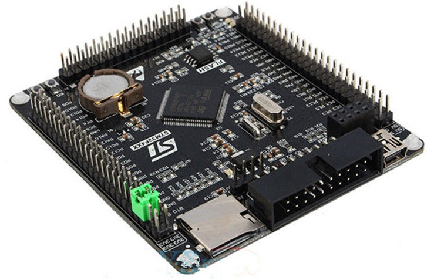

# STM32F4VE_LED-blinker
sample project for STM32F4VE board for Atollic TrueSTUDIO® IDE that make use of the 2 LED on the board and Key 0

This code is used for programming a LED blinker code with ST-LINK programmer and Atollic TrueSTUDIO® IDE on the STM32_F4VE version V2.1
The delay function use the system tick to have a configurable delay for the execution of code.
The code in delay.c have two different purpose, on is a blocking delay and the other is a settable counter that get decremented at every system tick.
The ARM on the board is the STM32F407VET6, the project configuration have been generated with STM32CubeMX using the pin configuration from the schematic [STM32F407VET6_schematics.pdf](STM32F407VET6_schematics.pdf).

# Function
The programme will run in loop.
The LED D2 will blink every 500ms.
The LED 3 will turn ON when the key K0 is pressed.
